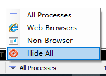
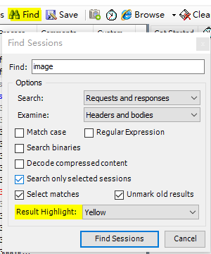
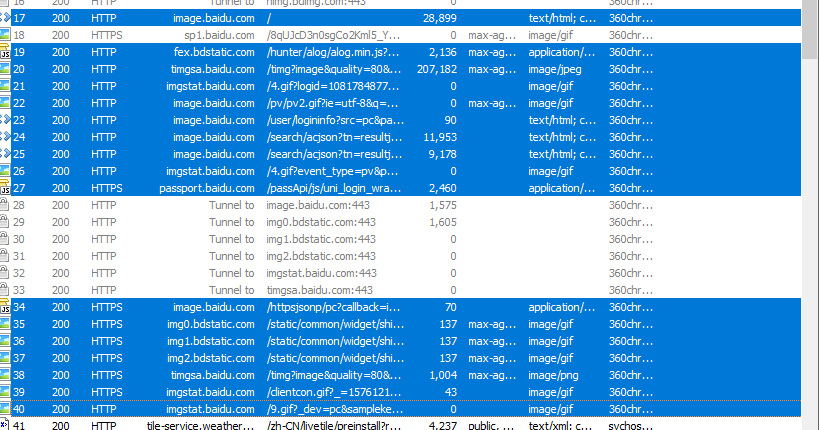
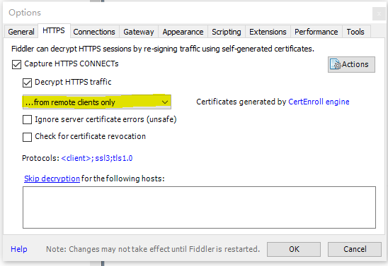
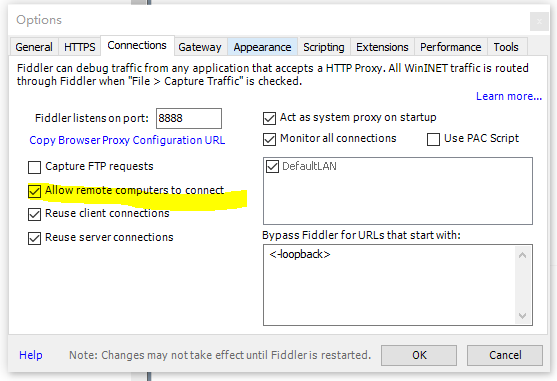
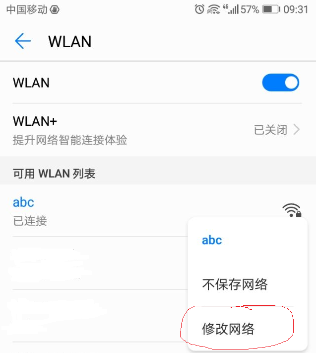
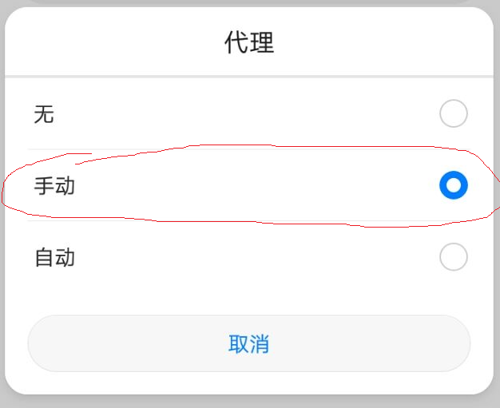
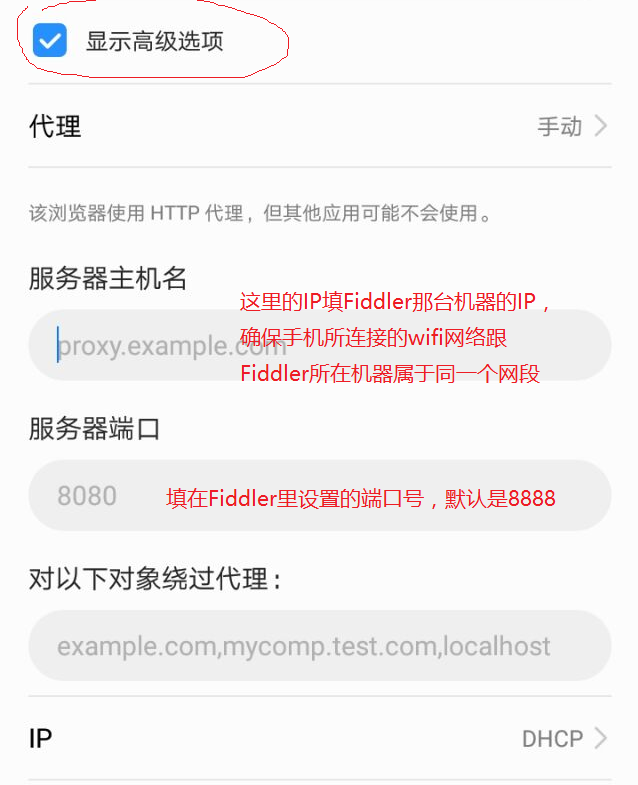
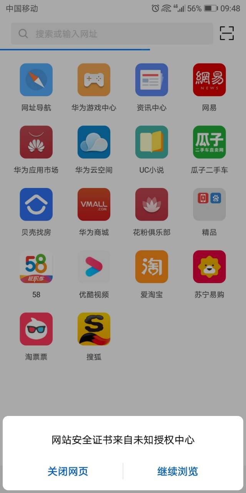
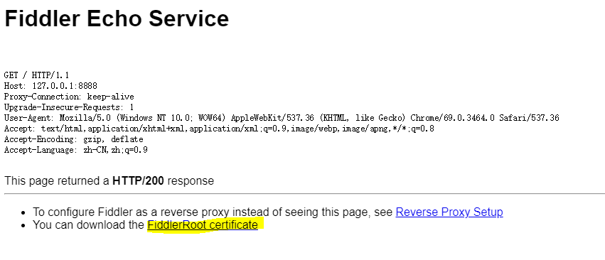

# 抓包工具Fiddler使用

## 下载和安装
* 下载   
https://www.telerik.com/download/fiddler   
输入邮箱和选择国家即可下载
* 安装   
直接下一步，没有什么问题。装完是英文界面，官方没有汉化包，网上有汉化的版本，如果需要可以自己去找一下。
* 首次使用配置  
1. 开启HTTPS抓取  
Tools > Fiddler Options > HTTPS > Decrypt HTTPS Traffic box.

 

2. 开启Win8+系统WinRT(UWP)应用抓取  

 

 

 

## 基本使用
* 开始和停止抓取  
  软件启动后，会自动启动抓取。如果需要停止抓取，可以单击状态栏上的Capturing  

* 指定进程抓取  
在状态栏上单击**All Processes**，可以筛选要抓取的程序。可选项为全部进程(All Processes)，只抓取浏览器(Web Browsers)，只抓取非浏览器(Non-Browser)，隐藏所有(Hide-All)  
  
 在工具栏单击**Any Processes**，再将光标拖动到需要抓取的程序窗体，可以对指定程序进行抓取。我这里选取了360极速浏览器，可以看到整个浏览器窗体会变色，代表选中。  
  
  
* 查看会话列表  
运行fiddler，再打开浏览器。可以在左侧列表中看到会话情况

 

* 查看会话详情  
双击左边列表，可以在右侧看到会话详情。  
点击Statistics，查看会话统计。点击Inspectors，可以查看会话的详细。点击TimeLine，可以查看时间线。

 

 

* 搜索和过滤会话列表  
单击工具栏上的**Find**按钮，可以打开搜索对话框  
  
这里可以通过会话内容查找会话，也可以使用正则来匹配会话。

* 选择子会话和父会话  
  在左侧会话列表中选择一个会话  
  按下**P**键可以选择该会话的父会话，如果该会话没有父会话，则会取消选中任何会话
  按下**C**键可以选择该会话的子会话，如果该会话没有子会话，则会继续选中当前会话  
  

  ## 进阶使用
  * 与.Net程序进行交互  
  https://docs.telerik.com/fiddler/Extend-Fiddler/ExtendWithDotNet

  * 抓取手机上数据包(以安卓为例，IOS系统可以访问以下链接https://docs.telerik.com/fiddler/Configure-Fiddler/Tasks/ConfigureForiOS)

  1. Tools->Options->HTTPS->选择“from remote clients only”  
  这一步也可以不设置， 依旧抓取全部会话。 from remote clients only表示 只抓取远程客户端，也就是手机或其它使用代理连进来的设备。  
    

  2. 开启代理服务  
  切换到Connections Tab，钩上“Allow remote computers to connect"    
  

  3. 保存设置后，重启Fiddler

  4. 设置手机(这里以安卓手机为例)   
    打开手机wifi设置，选择修改网络。(这里是已经连接wifi的情况，如果未连接wifi，可以在连接时，打开连接的高级选项，直接设置代理 )   
      
    钩上显示高级选项  
      
    选择手动设置代理，设置相关参数即可   
      
    此时手机是通过代理上网，Fiddler就可以抓取手机的包。  
    在初次使用时，会出现下面这种情况
      
    这个时候，我们可以访问下面这个网址，下载并安装证书即可(端口号是你设置的那个端口号)  
    http://ipv4.fiddler:8888  
    
    安装证书的位置各大厂家都不太一样，我的手机是安全和隐私->更多安全设置-> 从SD卡安装证书，选择刚刚下载的那个证书文件即可。可以参考以下链接https://jingyan.baidu.com/article/915fc4143beb3d11384b2034.html

